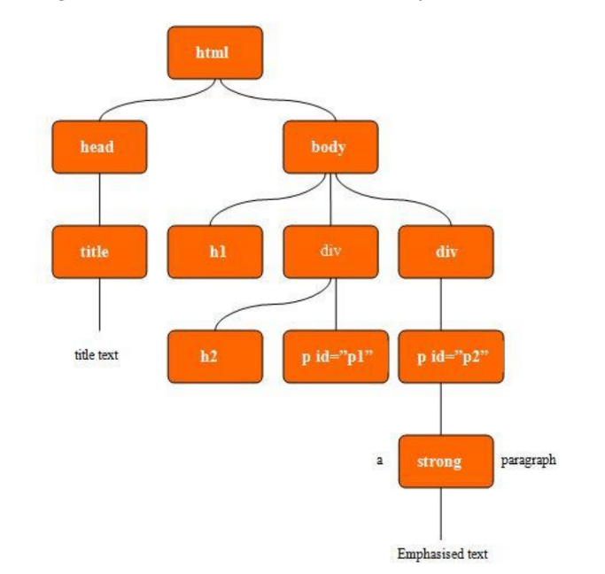

title: Introductie jQuery
class: animation-fade
layout: true

<!-- This slide will serve as the base layout for all your slides -->
.bottom-bar[
  {{title}} @ ITFactory Thomas More 2019
]

---

# Loading jQuery

.jq-Ready[
  
]

---
class: impact

# Dienstmededeling

---

# Skillstaak 4 is hier!

* 2 punten op taak AnySurfer
* 3 punten op Photoshop

--

## AnySurfer
* 13 December: Auditorium 1
* beoordeel twee site op 15 toegankelijkheidscriteria
* **Help AnySurfer toegankelijkheid te verbeteren!**

---

.col-6[
# Skillstaak 4 is hier!
## Photoshop
### Deel 1
Ga op reis met Photoshop!
]

.col-6[
  
]

---
.col-6[
# Skillstaak 4 is hier!
## Photoshop
### Deel 2
Maak je eigen startup!  
*(PS: ik zoek een job, moest je echt een startup hebben)*
]

.col-6[
  
]
---


## 

---

# Wat is jQuery

.col-6[
* JavaScript **framework**
* Gebruikt op **80%** van alle websites
* Doel: JS **korter** en **makkelijker** maken
]

.col-6[

]

---

class: impact

# JavaScript
## Zeg nooit zomaar Java tegen JavaScript

---

# JavaScript

* 1995: Brendan Eich begint aan programeertaal voor Netscape Navigator
* Doel: **interactief** web


--

* Sun's Java kreeg populatiteit
* Netscape: volg de trend


--

* Mei 1995: 10 dagen later: eerste prototype **"Mocha"**
* Publieke naam: LiveScript


--

* September 1995: *Java*Script

---

# Java?

## Java
```java
String[] testStrings = {"een", "twee"};
Array.sort(testStrings, (s1,s2) -> s1-s2);
```

## JavaScript
```js
var testStrings = ["een", "twee"];
testStrings.sort(function(s1, s2){return s1-s2})
```

---
# De naam "JavaScript"
* Pure marketing van Netscape
* Veel kritiek...


--

* Internet Explorer: **JScript**


--

* November 1996: JavaScript is ECMA Standard
* "ECMAScript"
--

* Vandaag: ECMAScript en JavaScript zijn synoniemen

---

# JavaScript laden

.col-5[
  ## Voor &lt;/body&gt;
  ```html
  <body>
    <script>
      alert("Hello World")
    </script>
  </body>
  ```
]

.col-2[
  &nbsp; <!--dirty trick i know...-->
]

.col-5[
  ## In &lt;head&gt;
   ```html
  <head>
    <link [...]>
    <script>
      alert("Hello World")
    </script>
    <meta [...]>
  </head>
  ```
]

---

# JavaScript laden

.col-5[
  ## In tag
   ```html
<body>
  <script>
    alert("Hello World")
  </script>
</body>
  ```
]

.col-1[
  &nbsp; <!--dirty trick i know...-->
]

.col-6[
  ## In file
   ```html
<body>
  <script src="./mijnscript.js">
  </script>
</body>
  ```
  ```js
alert("Hello World")
  ```
]

---
# JavaScript in het kort

```js
// Statements can be terminated by ;
doStuff();

// There's also a boolean type.
true;
false;

// Strings are created with ' or ".
'abc';
"Hello, world";
```
Bron: https://learnxinyminutes.com/docs/javascript/

---
# JavaScript in het kort

```js
// Variables are declared with the `var` keyword. 
var someVar = 5;
// Arrays are ordered lists of values, of any type.
var myArray = ["Hello", 45, true];

// The `if` structure works as you'd expect.
if (someVar == 3){
    // evaluated if someVar is 3
} else {
    // evaluated if it's not 3
}

```
Bron: https://learnxinyminutes.com/docs/javascript/

---
# JavaScript in het kort

```js
// JavaScript functions are declared with the `function` keyword.
function myFunction(thing){
    return thing.toUpperCase();
}
myFunction("foo"); // = "FOO"

// Function objects don't even have to be declared with a name
// those are anonymous functions
setTimeout(function(){
    // this code will be called in 5 seconds' time
}, 5000);

```
Bron: https://learnxinyminutes.com/docs/javascript/

---

# Interactieve HTML?

.col-6[
  * **D**ocument **O**bject **M**odel
]

.col-6[
  
]

---

# **D**ocument **O**bject **M**odel
## Inhoud element met ID aanpassen
```html
<html>
<body>
  <script>
    document.getElementById("demo").innerHTML = "Hello World!";
  </script>
</body>
```
---

# **D**ocument **O**bject **M**odel
## Inhoud elementen met een klasse aanpassen
```html
<html>
<body>
  <script>
    var demos = document.getElementsByClassName("demo");
    for (var demo in demos) {
      if (demos.hasOwnProperty(demo)) {
        demo.innerHTML = "Hello World";
      }
    }
  </script>
</body>
```

---

class: impact

## Dit kan simpler...

---

# jQuery

* JS library speciefiek voor DOM
* Gemaakt in 2006 door John Resig
* Maakt gebruik van **CSS selectors**  


--
* Vandaag nog de basis van complexere oplossingen

--
* Bootstrap <3 jQuery (zie semester 2)

---
# Waar vinden we jQuery?

https://jquery.com/download/

--

```html
<script src="scripts/jquery-3.4.1.js"></script>
```

--
## Liever een Content Delivery Network?
```html
<script 
src="https://ajax.googleapis.com/ajax/libs/jquery/3.4.1/jquery.min.js">
</script>
```
* Vaak server dicht bij
* Vaak in cache van andere sites!
---

# jQuery

```html
  <script src="scripts/jquery-3.4.1.js"></script>
  <script src="scripts/mijnscript.js"></script>
  <script>
      //mijn lokaal script
      $('.demo').text('Hello World');
  </script>
</body>
```

--
### Kortere syntax dan (Vanilla) JS!

---
# A dollar is what I need!
`$()` is kort voor `jQuery()`
```js
function jQuery(selector) {
  return {[jQuery Magic]}
}
```

```js
var $ = jQuery
```

---

# jQuery syntax

### Geef alle `img` tags:
```js
var images = $('img')
```

--

### Geef alle klasse `afbeelding`
```js
var images = $('img')
images.addClass('afbeelding')
```

--

### In het kort
```js
$('img').addClass('afbeelding')
```

---
class:impact
## Let op...
## Als JavaScript een trein was zou het proberen te remmen maar toch elk station voorbij rijden...

---

# Document Ready?
```html
<script>
  $(document).ready(function(){
    // plaats alle code hier
    // pas hier zijn alle DOM elementen geladen!
  })
</script>
```
```html
<script>
  $(function(){ // korte schrijfwijze
    // plaats alle code hier
  })
</script>
```
---

# jQuery Selectors


| Selector        | Beschrijving             |
| ------------- |-------------|
| $(‘#item_1’) | Het element met id ‘item_1’ |
| $(‘img[alt=“jQuery”]’) | Alle images met alt-tekst ‘jQuery’ |
|$(‘img[alt^=“j”]’); | Alle images met alt-tekst die met ‘j’ begint|
|$(this) | Het huidige HTML element|
|$('p.foo')| Alle p-tags met class foo|

--
&nbsp;
### Combinatie CSS3 + jQuery specifiek

---
# DOM hiërarchie

## Descendant selector
| Selector        | Beschrijving             |
| ------------- |-------------|
|$(‘table tr’) | Alle tr-tags binnen een table |
|$(‘table td’) | Alle td-tags binnen een table |
| $(‘table td a’) | Alle linken in een td-tag binnen een table |
| $(‘ul *’) | Alle tags binnen een ul-tag |

---
# DOM hiërarchie

## Child selector
| Selector        | Beschrijving             |
| ------------- |-------------|
|$(‘div > p’) | Alle p-tags die een child zijn van een div (rechtstreeks onder de div zitten)|
| $(‘article > section > img’) | Alle img-tags die child zijn van een section en de section is een child van een article |

---

# DOM hiërarchie

## Sibling selector (alle volgende)
| Selector        | Beschrijving             |
| ------------- |-------------|
| $(‘h3 ~ p’) | Alle p-tags die op hetzelfde niveau staan en volgen op een h3 tag
| $(‘li ~ li’) | Alle li-tags die op hetzelfde niveau staan en volgen op een li tag |


---
# DOM hiërarchie

##Sibling selector (dadelijk aangrenzende)

| Selector        | Beschrijving             |
| ------------- |-------------|
|$(‘h3 + p’) |Alle p-tags die op hetzelfde niveau staan EN DADELIJK  volgen op een h3-tag |
| $(‘li + li’) | Alle li-tags die op hetzelfde niveau staan EN DADELIJK volgen op een li-tag |


---

# addClass && removeClass
## addClass
```js
$('img').addClass('afbeelding')
```

.col-6[
  ## Voor
  ```html

  ```
]

--

.col-6[
  ## Na
  ```html

  ```
]

---

# addClass && removeClass
## removeClass
```js
$('img').removeClass('afbeelding')
$('img').removeClass('col-md-6')
```

.col-6[
  ## Voor
  ```html

  ```
]

--

.col-6[
  ## Na
  ```html

  ```
]

---
# Event handling

Event = **actie** van de gebruiker (of browser)

```js
$(function(){
  $("#target").click(function() {
    alert("Je klikte op mij!!!");
  })
})
```

<button id="target-1">Klik op me!</button>

---

# Event handling

.row[
.col-6[
```js
$("#target").click(function() {
  $("#box").removeClass("blue");
  $("#box").addClass("green");
})
$("#target").dblclick(function() {
  $("#box").removeClass("green");
  $("#box").addClass("blue");
})
```
]

.col-6[
  ```css
.blue {
  background-color: blue;
}

.green {
  background-color: green;
}
  ```
]

]

.col-6[
<button id="target-2">Klik op me!</button>
]

.col-6[
<div id="box-2" class="box">Box</div>
]

---

class: impact

## Er zijn enorm veel mogelijke events!
## https://oscarotero.com/jquery/ 

---

# Debug Helpers
## alert()
.row[
.col-6[
  ```js
alert("Bericht");
```
]

.col-2[
  &nbsp;
]

.col-4[
  <button id="alert-demo">alert</button>
]
]

## console.log()
.row[
.col-6[
```js
console.log("Bericht");
console.log($("#console-demo"));
```
]

.col-2[
  &nbsp;
]

.col-4[
  <button id="console-demo">console.log</button>
]
]

---
# Samengevat
* JavaScript -> programeren in de browser
* jQuery -> JS Framework, focus op DOM `$("css selector")`
* Let op `$(document).ready()`!!!
* Aanpassen? `$().addClass()` `$().text()`
* Events -> Acties van gebruikers `$().click(function(){})`
* console.log() -> Debug hulp `console.log("Bericht")`

---
class:impact

## Slides: https://maartje.dev/slides-jquery/
## PDF: https://maartje.dev/slides-jquery/presentation.pdf